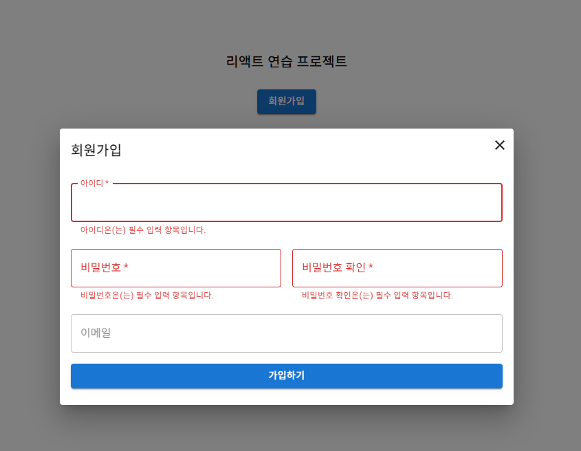

## 리액트 연습장
### 프로젝트 환경
 - React 19.2.0 + Vite 7.2.4
 - material-ui 7.3.6

### 실행 방법
 1. 프로젝트 clone
 2. 프로젝트 최상단 폴더에서 npm install 명령어 입력
 3. 프로젝트 최상단 폴더에서 npm run dev 명령어 실행

### 끄적끄적 내역(Image)
#### - Register Form
